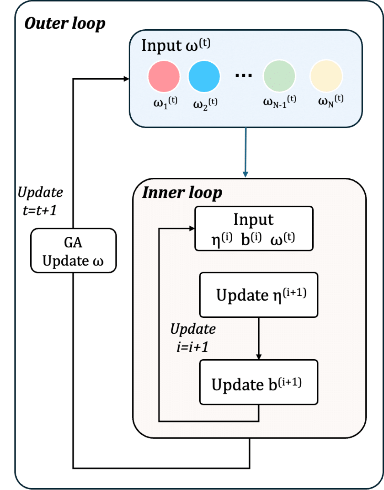

# Practical-RIS-Dual-Loop-Opt: Over-the-Air Computation via Practical Phase-Shift Reconfigurable Intelligent Surface

## Overview

This project implements and evaluates an Over-the-Air Computation (AirComp) system enhanced by a Reconfigurable Intelligent Surface (RIS). Unlike ideal RIS models, this work employs a **practical phase-shift model** that captures the intrinsic amplitude-phase coupling of RIS elements. The primary goal is to minimize the Computation Mean Square Error (CMSE) by jointly optimizing user transmit coefficients, the access point (AP) receive factor, and the RIS reflection matrix.

The core of this project is a novel **dual-loop optimization framework**:
*   **Outer Loop**: Utilizes a Genetic Algorithm (GA) to find a near-optimal RIS reflection matrix.
*   **Inner Loop**: Employs an Alternating Optimization (AO) algorithm to iteratively optimize the transmit coefficients and the receive factor for a given RIS configuration.


*Figure 1: Dual-loop optimization framework. The outer loop uses GA to optimize RIS reflection matrix, while the inner loop alternately optimizes transmit coefficients and receive factor.*

The code and simulation results are based on the research paper: "Over-the-Air Computation via Practical Phase-Shift Reconfigurable Intelligent Surface".

## Quick Start
first , you can get the code by
```bash
git clone https://github.com/zheng977/Practical-RIS-Dual-Loop-Opt.git
```

## System Requirements

You can install the required libraries using pip:
```bash
pip install -r requirements.txt
```

## Directory Structure

```
.
├── expierements/          # Python scripts for running simulations
│   ├── compary_alog.py
│   ├── different_alpha.py
│   ├── different_dB.py
│   ├── improvement.py
│   ├── iteration.py
│   └── stimulate_differnt_N.py
├── results/               # Simulation results (figures and parameters)
│   ├── Diferent_RIS_N.png
│   ├── Iteration.png
│   ├── define.md          # Parameters used for generating figures
│   ├── different alpha 's MSE.png
│   ├── different dB 's MSE.png
│   └── improvment.png
├── ao_algorithm.py        # Core AO algorithm components
├── channel.py             # Channel simulation model
├── location.py            # User and AP/RIS location generation
├── main.py                # Main script to run experiments (if applicable, or orchestrates calls to expierements)
├── optimizers.py          # Optimization algorithms (e.g., GA)
└── README.md              # This file
```

## Key Results and How to Run

Our proposed dual-loop optimization algorithm demonstrates effective convergence and achieves superior performance in minimizing Computation Mean Square Error (CMSE) compared to traditional Successive Convex Approximation (SCA) methods, especially when considering the practical amplitude-phase coupling of RIS elements.

To run the experiments and reproduce the results, navigate to the project's root directory and execute the Python scripts located in the `expierements/` folder. For example:

```bash
python expierements/iteration.py
python expierements/compary_alog.py 
# and so on for other scripts like different_alpha.py, different_dB.py, stimulate_differnt_N.py
```

Below are some key figures from our simulations. The parameters for each figure can be found in `results/define.md`.

**1. Algorithm Convergence (MSE vs. Iterations)**
This figure shows the convergence behavior of our proposed GA-based algorithm compared to SCA and a random phase baseline. Our algorithm converges to a significantly lower MSE.


*Parameters used: K=20 users, N=200 RIS elements, AP noise variance sigma_a2=1e-12, max_iter=30, alpha_min=0.2.*

**2. Performance vs. Number of RIS Elements (MSE vs. N)**
Increasing the number of RIS elements (N) significantly reduces the MSE. Our GA-based approach consistently outperforms SCA.


*Parameters used: K=20 users, AP noise variance sigma_a2=1e-11, max_iter=15, alpha_min=0.2.*

**3. Performance vs. SNR (MSE vs. SNR)**
Our proposed method shows robust performance across different SNR levels, achieving substantially lower MSE than baselines, especially at higher SNRs.


*Parameters used: K=20 users, N=200 RIS elements, max_iter=50, alpha_min=0.2.*

**4. Impact of RIS Reflection Amplitude (MSE vs. α_min)**
This figure demonstrates the effect of the minimum RIS reflection coefficient (α_min) on performance, highlighting the importance of the practical amplitude-phase coupling model.


*Parameters used: K=20 users, N=200 RIS elements, AP noise variance sigma_a2=1e-11, max_iter=20.*


